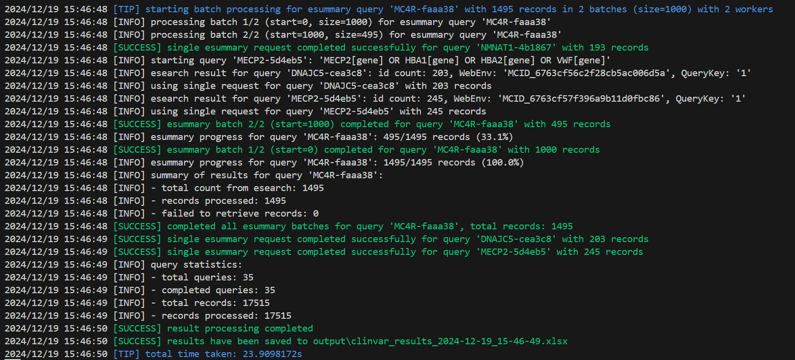
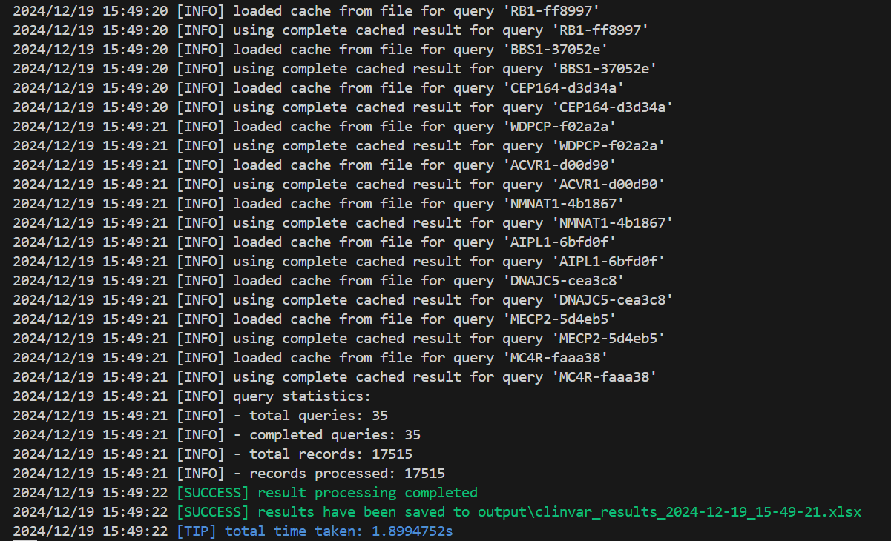
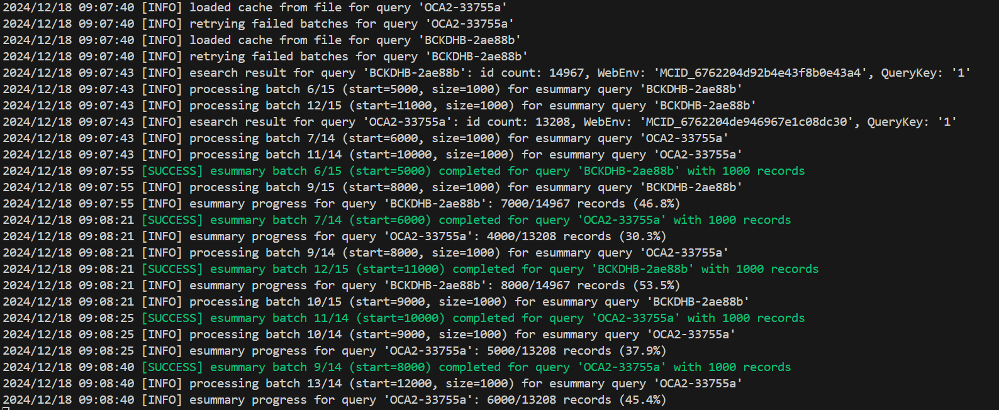
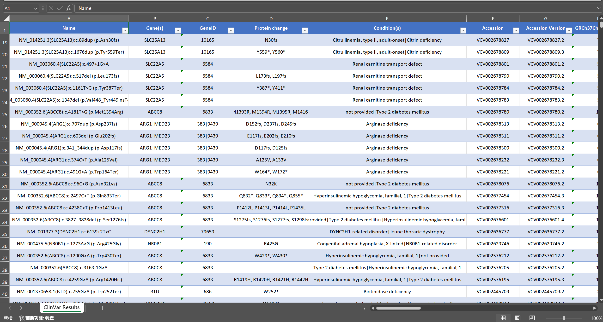
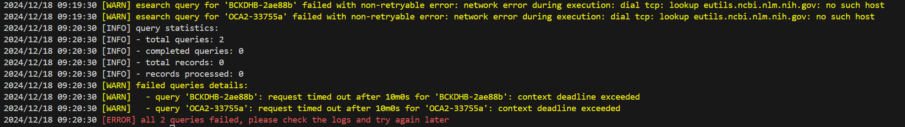
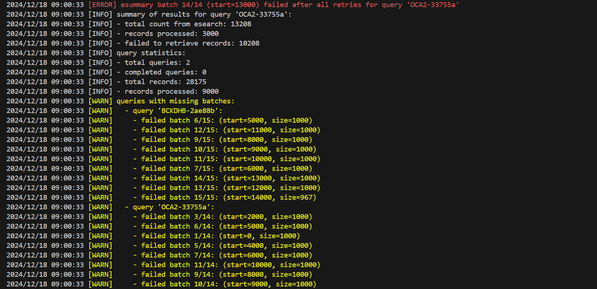

# ClinvarDL

ClinvarDL 是一个用于从 NCBI ClinVar 数据库下载数据的命令行工具。

## 功能特点

- 支持批量查询数据，自动处理大量查询请求
- 支持查询过滤
- 支持数据缓存
- 支持数据完整度检查, 并自动重试
- 跨平台支持 (Windows, Linux, macOS)
- 支持输出为 Excel 文件，如需其他格式，请实现 [pkg/entrez/output/types.go](https://github.com/iEchoxu/clinvarDL/blob/main/pkg/entrez/output/types.go) 中的 `Writer` 接口
- 支持从 txt 文件中读取查询数据, 如需其他格式，请实现 [pkg/entrez/input/types.go](https://github.com/iEchoxu/clinvarDL/blob/main/pkg/entrez/input/types.go) 中的 `Parser` 接口


## 安装

可通过二进制安装或从源码构建。

### 二进制安装

在 [Releases](https://github.com/iEchoxu/clinvarDL/releases) 页面下载对应平台的二进制文件，解压后即可使用。

### 从源码构建

> 需要 Go 1.23.0 或更高版本。

```shell
git clone https://github.com/iEchoxu/clinvarDL.git
cd clinvarDL
go clean -modcache
go mod tidy

# 生成 Linux 二进制文件
CGO_ENABLED=0 GOOS=linux GOARCH=amd64 go build -o clinvarDL -gcflags "-N -l" -ldflags "-s -w" cmd/main.go

# 生成 Windows 二进制文件
CGO_ENABLED=0 GOOS=windows GOARCH=amd64 go build -o clinvarDL.exe -gcflags "-N -l" -ldflags "-s -w" cmd/main.go

# 生成 Mac 二进制文件
CGO_ENABLED=0 GOOS=darwin GOARCH=amd64 go build -o clinvarDL -gcflags "-N -l" -ldflags "-s -w" cmd/main.go
```

### Makefile 构建

使用 Make 构建不同平台的二进制文件：

构建所有平台
```shell
make all
```

构建特定平台
```shell
make windows # Windows (amd64)
make linux # Linux (amd64)
make darwin # macOS (amd64)
```

清理构建产物
```shell
make clean
```

## 使用方法

- 下载二进制文件后，解压到任意目录
- 进入解压后的目录, 运行命令： `./clinvarDL config`，该命令会提示配置 API key 及邮箱并生成配置文件
- 准备任务文件，文件格式请参考当前目录下的 `task.txt` 文件
- 运行命令： `./clinvarDL run -f task.txt`，该命令会从 NCBI ClinVar 数据库下载数据并保存到当前目录下的 `output` 文件夹中

## 命令说明

- `./clinvarDL config`: 配置 API key 及邮箱并生成配置文件
- `./clinvarDL config set api_key ***11111aaa***`: 设置 API key
- `./clinvarDL config set email abc@abc.com`: 设置邮箱
- `./clinvarDL config edit`: 编辑配置文件
- `./clinvarDL filters edit`: 编辑过滤器配置文件
- `./clinvarDL run -f ***.txt`: 从 NCBI ClinVar 数据库下载数据并保存到指定路径的 Excel 文件中

## 注意事项

- **该程序目前仅支持通过 gene symbols 方式从 NCBI ClinVar 数据库下载数据**
- 避免在任务文件中包含过多基因，建议分批处理
- 建议使用 API key 以获得更好的性能，[申请 NCBI API Key](https://ncbiinsights.ncbi.nlm.nih.gov/2017/11/02/new-api-keys-for-the-e-utilities/)
- 建议在上午 8-10 点、下午 3-5 点查询,避免在晚上查询（NCBI 服务响应较慢）

## 效果展示














